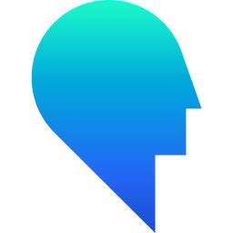

## Hi! 👋 My name is Konrad Konieczny.

### Ways to reach me

[comment]: # (TODO LinkedIn)

### I used to work with

<a style="text-decoration:none" href="https://getbootstrap.com/">
     

### I am currently working on

### I am feeling confident at

### I am currently learning

### I am going to learn

### My toolkit

### Besides programming I adore

